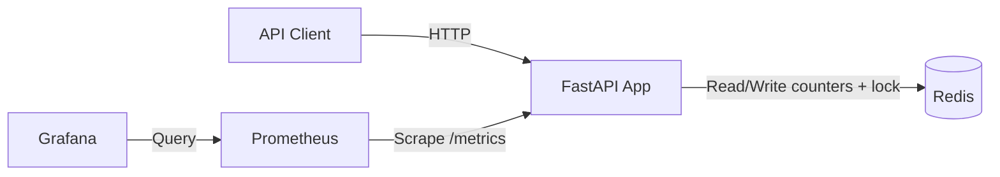
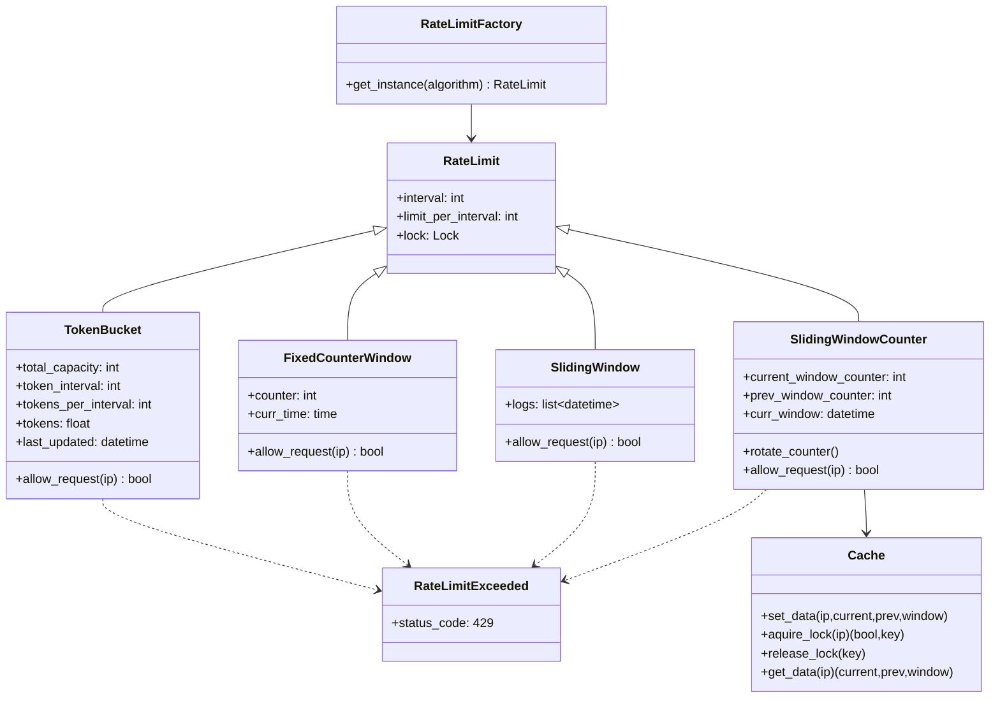
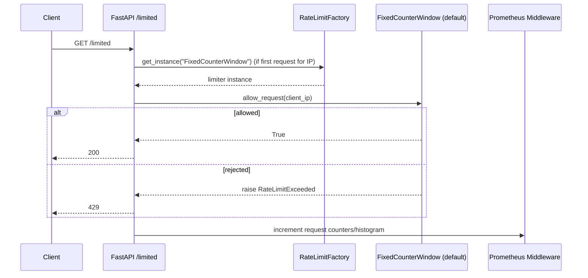
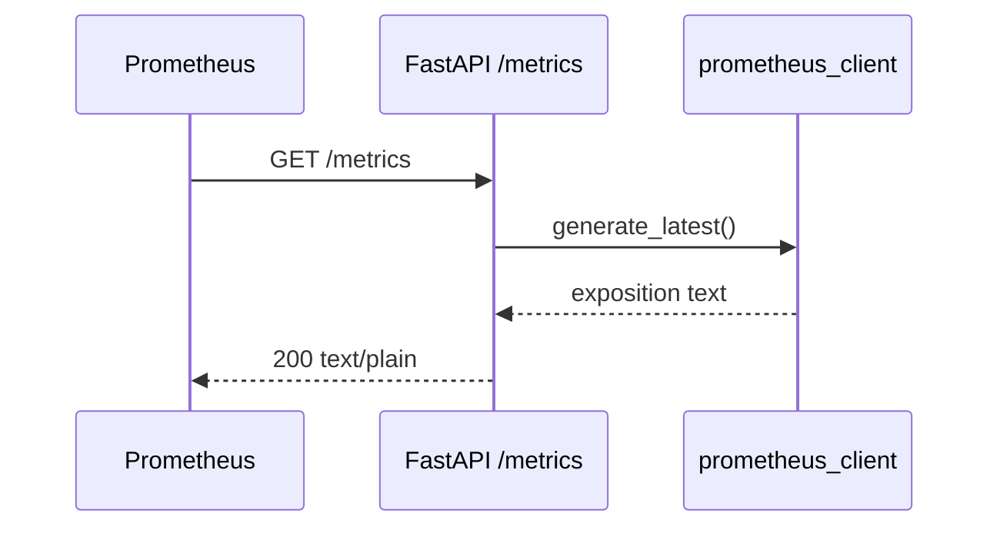
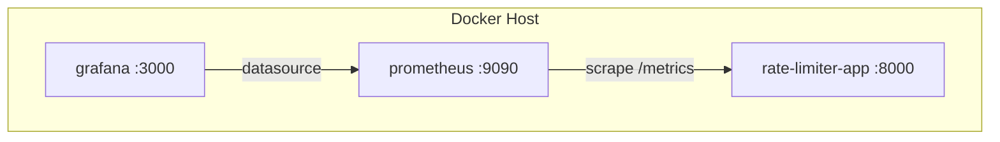

# EdgeShield Rate Limiter

A FastAPI-based service that demonstrates multiple rate-limiting algorithms and exposes Prometheus metrics for observability.

## 1. Scope and Goals

This repository implements a demo API with:
- A rate-limited endpoint (`/limited`)
- An unlimited endpoint (`/unlimited`)
- A metrics endpoint (`/metrics`) for Prometheus scraping
- Optional observability stack via Docker Compose (Prometheus + Grafana)

Primary OOAD goal: keep rate-limiting algorithms pluggable while presenting a stable HTTP API.

## 2. System Context

### External Actors
- API Client: browser, script, or service calling HTTP endpoints
- Prometheus: scrapes `/metrics`
- Grafana: visualizes Prometheus metrics
- Redis (logical dependency): used by `SlidingWindowCounter` implementation

### Context Diagram



Notes:
- Redis is required only for `SlidingWindowCounter`.
- Current `/limited` route uses `FixedCounterWindow` by default, so Redis is not required for default behavior.

## 3. Architectural Style

- Style: Layered modular monolith
- Entry/API layer: `api.py` (active), `main.py` (experimental middleware app)
- Domain/algorithm layer: `algortihms/limiting_algorithms.py`
- Service/factory layer: `services/rate_limiter.py`
- Infrastructure adapter layer: `services/cache.py` (Redis)
- Operations layer: `monitoring/` + Docker artifacts

## 4. Module View

- `api.py`
  - FastAPI application used by container entrypoint.
  - Implements routes and middleware-based metrics instrumentation.
  - Selects limiter implementation via `RateLimitFactory`.
- `services/rate_limiter.py`
  - Factory responsible for creating limiter objects.
- `algortihms/limiting_algorithms.py`
  - Core limiter classes and `RateLimitExceeded` exception.
- `services/cache.py`
  - Redis wrapper used by `SlidingWindowCounter`.
- `main.py`
  - Separate experimental middleware demo app; not used by Docker CMD.
- `monitoring/prometheus.yml`
  - Prometheus scrape targets.
- `monitoring/grafana/provisioning/datasources/datasource.yml`
  - Auto-provisioned Prometheus datasource in Grafana.

## 5. Object-Oriented Analysis and Design (OOAD)

### 5.1 Domain Model

Core concepts:
- `RateLimit`: base abstraction holding shared policy knobs (interval, per-interval limit, lock)
- `RateLimitStrategy` concrete implementations:
  - `TokenBucket`
  - `FixedCounterWindow`
  - `SlidingWindow`
  - `SlidingWindowCounter` (Redis-backed)
- `RateLimitFactory`: strategy creation point
- `Cache`: infrastructure service for Redis reads/writes/lock operations
- `RateLimitExceeded`: domain exception mapped to HTTP 429

### 5.2 Class Diagram



### 5.3 Responsibilities (CRC-style)

- `RateLimit` (base)
  - Responsibilities:
    - Provide common policy defaults (`60 req / 60 sec`)
    - Provide synchronization primitive for subclasses
  - Collaborators: concrete limiter subclasses

- `TokenBucket`
  - Responsibilities:
    - Refill tokens based on elapsed time
    - Allow request if token available; otherwise raise limit exception
  - Collaborators: `RateLimitExceeded`

- `FixedCounterWindow`
  - Responsibilities:
    - Track count in current minute window
    - Reset on minute boundary
    - Enforce max count
  - Collaborators: `RateLimitExceeded`

- `SlidingWindow`
  - Responsibilities:
    - Keep timestamp log and evict expired timestamps
    - Enforce moving-window request cap
  - Collaborators: `RateLimitExceeded`

- `SlidingWindowCounter`
  - Responsibilities:
    - Maintain weighted current/previous minute counters
    - Persist state in Redis
    - Coordinate updates via lock key
  - Collaborators: `Cache`, `RateLimitExceeded`

- `RateLimitFactory`
  - Responsibilities:
    - Build limiter instances based on algorithm identifier
  - Collaborators: all concrete limiter classes

- `Cache`
  - Responsibilities:
    - Encapsulate Redis hash storage for counters/window metadata
    - Acquire/release lock keys
    - Convert Redis payload to Python objects
  - Collaborators: Redis server, `SlidingWindowCounter`

- `api.py` route layer
  - Responsibilities:
    - HTTP endpoint contracts
    - Metrics collection and publication
    - Per-IP limiter instance lifecycle in `ip_addresses`
  - Collaborators: `RateLimitFactory`, `RateLimitExceeded`, Prometheus client

### 5.4 Key Design Decisions

- Strategy pattern via factory
  - Reason: runtime algorithm switching without changing route contract.
- Exception-based rejection flow (`RateLimitExceeded`)
  - Reason: central HTTP semantics (`429`) with concise endpoint code.
- In-memory per-IP map (`ip_addresses`) in API layer
  - Reason: simple demo-level per-client state management.
- Metrics middleware (cross-cutting concern)
  - Reason: collect latency/count for all paths without per-route duplication.

## 6. Runtime View (Sequence)

### 6.1 `GET /limited`



### 6.2 `GET /metrics`



## 7. State Model

### 7.1 Active route state (`/limited` default)
- State location: process memory (`ip_addresses` dict)
- Key: client IP
- Value: limiter instance (`FixedCounterWindow`)
- Lifetime: Python process lifetime

### 7.2 Redis-backed state (when `SlidingWindowCounter` used)
- Key: `<ip>` hash with fields:
  - `current_window_counter`
  - `prev_window_counter`
  - `curr_window`
- Expiration: 60 seconds
- Lock key: `lock:<datetime>` (created/deleted per request)

## 8. Concurrency and Thread-Safety

- In-memory algorithms (`TokenBucket`, `FixedCounterWindow`) use `threading.Lock` around critical updates.
- `SlidingWindow` currently uses `while self.lock:` rather than acquiring the lock context; behavior should be corrected for real concurrent safety.
- `SlidingWindowCounter` uses Redis-based lock keys, but lock key naming is timestamp-based and not per-IP deterministic; this is demo-safe but not production-grade distributed locking.

## 9. Deployment View

### 9.1 Containers
- `app` (`rate-limiter:latest`): runs `uvicorn api:app`
- `prometheus` (`prom/prometheus:v2.53.2`)
- `grafana` (`grafana/grafana:11.1.4`)

### 9.2 Deployment Diagram



## 10. API Contracts

### `GET /limited`
- Success: `200`, body: `"This is a limited use API"`
- Throttled: `429`, body from `RateLimitExceeded`
- Default policy in current code path: `FixedCounterWindow`, `60 req/min` per client IP

### `GET /unlimited`
- Success: `200`, body: `"Free to use API limitless"`

### `GET /metrics`
- Success: `200`, Prometheus text exposition format

## 11. Observability Model

Metrics exposed:
- `http_requests_total{method,path,status}`
- `http_request_duration_seconds{method,path}`
- `rate_limited_requests_total{path}`

Sample queries:

```promql
sum(rate(http_requests_total[1m])) by (path, status)
```

```promql
histogram_quantile(0.95, sum(rate(http_request_duration_seconds_bucket[5m])) by (le, path))
```

```promql
sum(rate(rate_limited_requests_total[1m])) by (path)
```

## 12. Local Runbook

### 12.1 Python runtime

```bash
python3 -m venv venv
source venv/bin/activate
pip install -r requirements.txt
uvicorn api:app --host 0.0.0.0 --port 8000 --reload
```

### 12.2 Docker app only

```bash
docker build -t rate-limiter:latest .
docker run --rm -p 8000:8000 rate-limiter:latest
```

### 12.3 Full stack

```bash
docker compose up -d --build
```

- App: `http://localhost:8000`
- Prometheus: `http://localhost:9090`
- Grafana: `http://localhost:3000`

Grafana default credentials:
- User: `admin`
- Password: `admin`

## 13. Known Design Gaps and Improvement Backlog

1. `SlidingWindow` lock usage should use `with self.lock:` for true thread safety.
2. Redis lock implementation (`aquire_lock`) should use deterministic per-IP lock key with TTL + atomic release pattern.
3. In-memory `ip_addresses` state is per-process; multi-instance deployment can produce inconsistent enforcement.
4. Limiter policy values are hardcoded and should be externalized to configuration.
5. `main.py` hosts a separate sample app; consolidating or clearly separating demos would reduce maintenance overhead.
6. Package folder name `algortihms` is misspelled and should be renamed carefully with import updates.

## 14. File Map

- `api.py`: active FastAPI app + metrics middleware + routes
- `main.py`: separate middleware demonstration app
- `services/rate_limiter.py`: limiter factory
- `algortihms/limiting_algorithms.py`: limiter class hierarchy + domain exception
- `services/cache.py`: Redis adapter
- `docker-compose.yml`: app + monitoring topology
- `monitoring/prometheus.yml`: scrape config
- `monitoring/grafana/provisioning/datasources/datasource.yml`: Grafana datasource provisioning